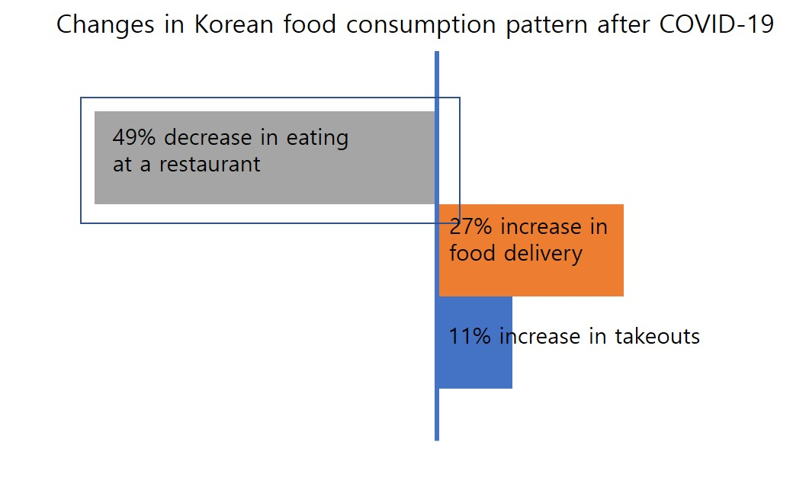
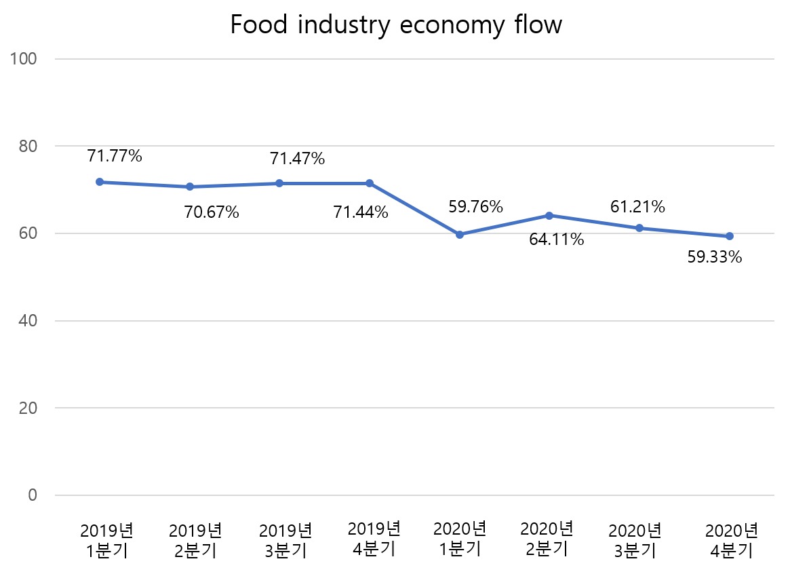
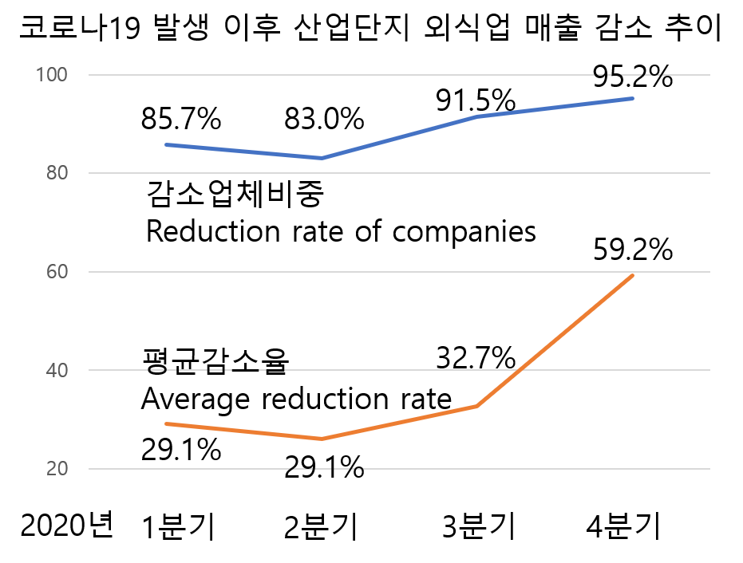

# HELLO, ABC(AI Beyond COVID19) - *[BOK JAK]*

```
"hello, we are Bok Jak, we solve your problem of safe and happy meal."
```
For 2021 KPMG Ideation Challenge

# *[Bok Jak]* solves all of your problems with Covid19

**[Bok Jak]** is responsible for your time and safety by providing dense information.
Did you not have enough time to find a restaurant with fewer people during the limited lunch time?
The delivery has increased due to Covid19, but has the sales been affected by the decrease in customers compared to before?
It's difficult to operate the company due to Covid19, do you want to reduce the operating cost?
Use **[Bok Jak]**.
Complexity is everything that solves all your problems.
Furthermore, we will enter a country suffering from Covid19 like Japan and provide safe and free meals to people around the world.

# Purpose of *[Bok Jak]*
*Team ABC* is made for a person that wants to have a safe meal with Covid19, restaurant owners that want to make a profit before Covid19, and a company that wants to reduce operating costs for its employees to have a safe meal.
We provide real-time density information for you and provides recommendation services to help diners make decisions for freer and safer meals. 
**[Bok Jak]** will also provide non-face-to-face order and payment services.
Finally, our goal is to reduce face-to-face contact with diners and restaurant staff to create a non-face-to-face meal and provide safety and freedom to individuals, restaurant owners and companys.

# what is your problem?
## 🙋 person :
* I want to eat a safe meal in a place with fewer people. 
* I visited several restaurants in person to find a restaurant with few people.
* It takes a lot of time to find a restaurant with fewer people.
* I always use the map app to use the visitor trend service in the restaurant, but not accurate.

## 👩‍🍳 restaurant owners :
* Sales plunge to Covid19. 
* There are online food services such as delivery, but I don't capture the same sales as before.
* Inventory should be thrown away because there are few customers.
* If there is a confirmed case in the store, I have to shut down our business, so I'm so worried about safety.

## 🏢 Company : 
* We were hit by sales with Covid19, which feel burdened by operating expenses. 
* If there is a confirmed case among employees, we should be shut down, so they should live a safe life.
* Employees are looking for restaurants with fewer people, so they don't start working even after lunch.

# Why *[Bok Jak]*
- McKinsey & Company's survey shows that Corona 19 has reduced meals in restaurants by 49%.



- According to data from the Gyeonggi Provincial Statistics Office, the most important factor in selecting restaurants after Covid19 is the density of customers (28%).


- According to the Korea Institute for Food and Rural Affairs, the 2020 Food Industry Business Index has continued to fall since Covid19, the lowest at 59.33% in the fourth quarter of 2020.



- According to the Ministry of Agriculture, Food and Rural Affairs, the proportion of restaurant businesses has increased since the Covid19 outbreak, reaching 95.2% in the fourth quarter of 2020.

- The same survey also showed that restaurant businesses saw their decline to 59.2% in the fourth quarter of 2020.



- In these surveys, Even if the delivery service is used, it is difficult for restaurants to recover their sales, and consumers regard the density of customers as an important factor in selecting restaurants.
- So we create **[Bok Jak]**, which reduces face-to-face contact in the restaurant as much as possible.

# Solution
## Built With
* Scikit-learn
* Google Maps API

## Installation
Either through cloning with git or by using npm (the recommended way):<br/>
We use google maps api.
`npm install react-google-maps --save`
`npm install react-geocode --save`

## Quick Test
#### React
```
import React from "react";
```

#### Google Maps API
In order to run the end-to-end tests, you'll need to supply your API key via an environment variable.<br/>
Inpout your api key to {MY_API_KEY}.

```
Geocode.setApiKey("{MY_API_KEY}")
```

```
<MapWithAMarker googleMapURL="https://maps.googleapis.com/maps/api/js?key={MY_API_KEY}&v=3.exp&libraries=geometry,drawing,places" />
```         
 

and 

```npm start```


#### Python
```
pip install scikit-learn
pip install pandas
pip install numpy
pip install scipy
pip install googlemaps
```

#### Google Maps Geocoding API
For testing, you'll need to supply your API key for geocoding and add it in recommender_model/data_refining.py.

# How to use
## 👩‍🏫 Tutorial (여기에 유저 입장에서 앱을 사용하는 화면을 캡쳐해서 넣고 설명을 넣을 것)

# About Team ABC
https://github.com/Soyeon-ErinLee/Dobby-AI
About us, Dobby-AI
이 링크의 어바웃 어스처럼 우리에 대한 설명을 한 페이지로 만들어서 넣는건?

*Team ABC* is made up of Brilliant business logists, professional developers, and experienced designers.
After Covid19, we had an uneasy meal with precious people.
This kind of problem is also experienced by other people who value safety with Covid19.
We have a professional career history in each field.
This experience allows *Team ABC* to make up for their shortcomings and create synergy effects.
*Team ABC* can provide safer and freer meals to people through our synergy effect.

|Photo|Name|Role|Career|
|--|--|--|--|
||Han Jeung Eun|Team Leader-Business Logistics|2020.04~ 이화여자대학교 창업지원 프로그램을 통한 ACOF창업 / 2019.03~12 이화여자대학교 미래설계 장학금으로 인문학과 비즈니스, IT를 결합한 교육방안 제안 / 2019.07 신한은행청장상 국토부 실시간 교통데이터 활용 공모전 |
||조규민|Business Logistics|2020.05 우수상 스마트미이더 창업 아이디어 공모전 / 2019.06 금메달 2019 World Invention Innovation Contest / 2018.10 우수상 2018년도 추계학술대회 및 캡스톤경진대회 / 2016.12 장려상 2016 지식재산 융합강좌 경진대회 (한국발명진흥 회장)|
||오채은|Design/Front-end/Interface|2020.12 보건복지부 장관상 제4회 정부혁신 끝장 개발대회 / 2020.12 한화 드림인 블록체인 온라인 해커톤 1차리그 수료 / 2020.09 더블슬래쉬 앱 웹 제작 동아리 / 2020.07 피로그래밍 웹프로그래밍 동아리 / 2020.11 서울특별시 공공보건의료재단 코로나 19 시민 백신 연구소 참여|
||이윤지|Engineering/Logic/Network/Data Science/Algorithm|2021.02~ 이화여자대학교 도전학기 '썸마켓'팀 대표 및 개발자 / 2020.12 한화 드림인 블록체인 온라인 해커톤 1차리그 수료 / 2020.12 장려상 NH디지털혁신캠퍼스챌린지 온라인 해커톤 / 2020.09~ 이화여자대학교 블록체인학회 기획 및 개발자 / 2020.09 한국정보화진흥원장상 제3회 데이터걸스데이|
||Lee Song|Data/Database/Data Science/Algorithm|2020.12~ 이화여자대학교 SW융합창의설계 교재개발 공동집필 / 2020.10~ Ewha Data Analysis Club / 2020.09~ Google Developer Student Club / 2019.05~12 SAP 본사(독일) IT Services 인턴 / 2018.09 사무총장상(대상) UNWTO 세계청년 도시관광 총회|

<!--Quote-->
> Keep distance, stay together, [Bok Jak]!

# License
MIT
